# Terraform Cloud
## Migrate Terraform files to Terraform Cloud
-  Create a Terraform Cloud account from this link https://app.terraform.io/signup/account
- Create an Organization. Click "Start from Scratch", enter a name and click create.
- Create a workspace.
  - Create a new GitHub repo that will contain your tf configuration
  - Push the files from the previous projects to the repo
  - On Terraform Cloud, click create workspace
  - Select "version control workflow"
  - Add the newly created repo
  - Provide a description for your workspace and click "Create workspace" 
  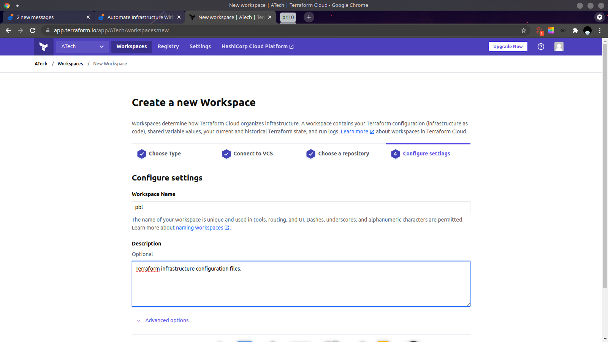
- Configure variables
  - Click Variables from the top tab in your workspace, under the workspace name
  - Scroll down to Environment Variables and create variables for your access key id and secret access key you got from AWS.
   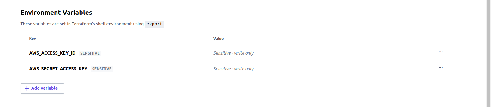

- Run **plan** and **apply** from console
  - Click on the Runs tab
  - Click "Queue plan"
  - After the **plan** run is complete, click "Confirm and apply". Enter a comment and click "Confirm plan" to apply the configuration. 
 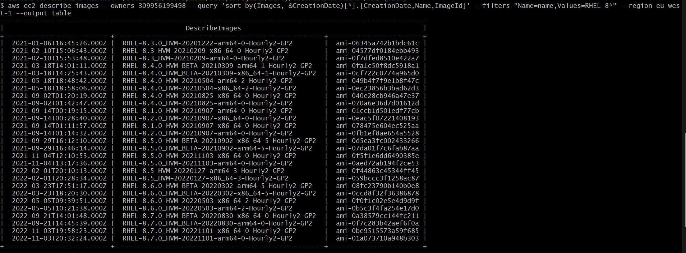 

- Test automated **terraform plan** 
  - Edit a file in your repo, and commit. A **plan** run should be triggered automatically.

## Practice Task 1
- Configure 3 branches in your terraform repo for dev, test and prod
- Make necessary configurations to trigger runs automatically only for **dev** environment.
  - Create a new workspace, select "version control workflow"
  - Select "GitHub" as version control provider
  - Choose the repo that contains your tf files
  - Enter the workspace name (e.g terraform-cloud-dev)
  - Click Advanced options, under VCS branch, enter the branch you want to configure (e.g dev)
   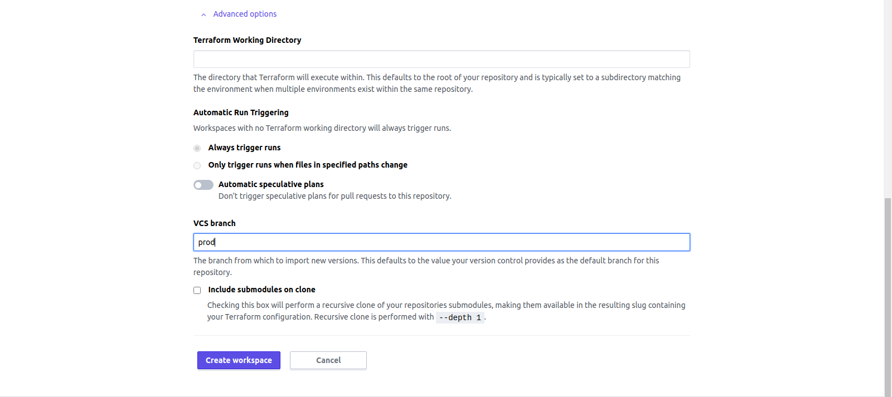
   
  - Click Create Workspace
  - Configure your variables as above
  - Click the Settings drop down, beside Variables
  - Click Run Triggers
  - Select the workspace you created previously
- Create email and Slack notifications
  - Click on Settings -> Notifications
  - Select Email
  - Enter a name for the notification
  - Select notfication recipients
  - Under Triggers, click the "Only certain events" radio button
  - Check the boxes you want to be notfied for.
   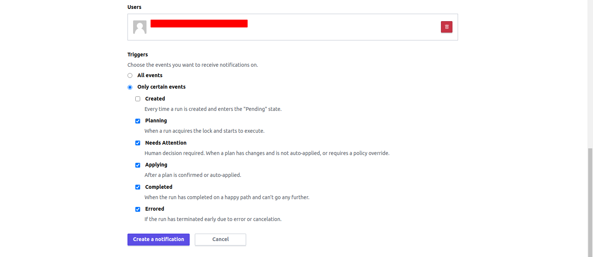
   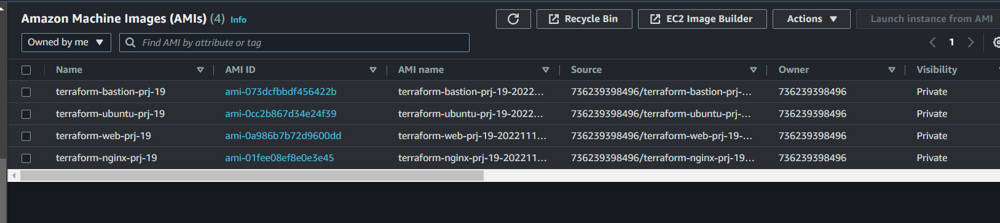
  - To configure Slack notification, choose Slack instead of Email
  - See how to get your Slack webhook here: https://api.slack.com/messaging/webhooks#create_a_webhook
  - Then configure everything else as with Email configuration
- Apply destroy
  - Click Settings -> "Destruction and Deletion"
  - Under Manually destroy, click "Queue destroy plan"
  - Enter the workspace name and click "Queue destroy plan"
  
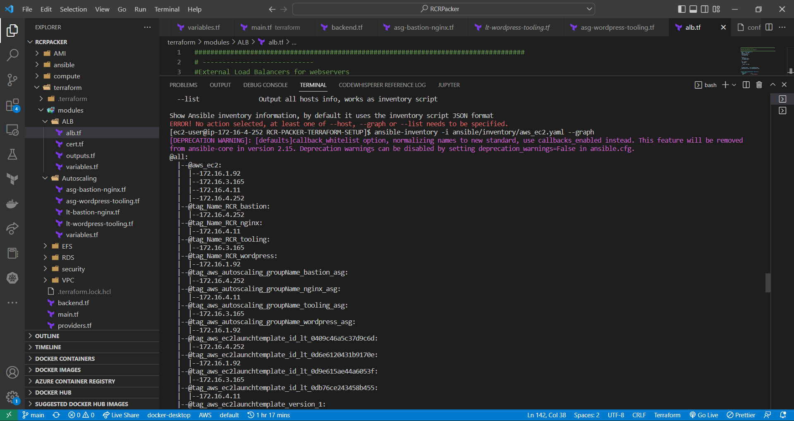
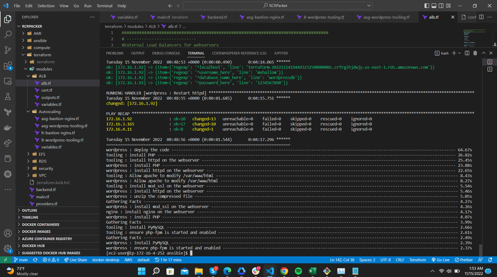

## Practice Task 2
- Create a simple Terraform repository that will be your module
  - Clone from this repo https://github.com/hashicorp/learn-private-module-aws-s3-webapp
  - Your repo's name should be in the form terraform-\<PROVIDER>-\<NAME>
  - Click "Tag release" from the left pane
  - Create a new release
  - Click "Create a new release", and add 1.0.0 to the tag version field, and set the Release title to anything you like.
  - Click "Publish release"
- Import the module into your private repository
  - On your Terraform cloud, click Registry on the top pane
  - You'll need to add a VCS provider. Select GitHub (Custom) when prompted 
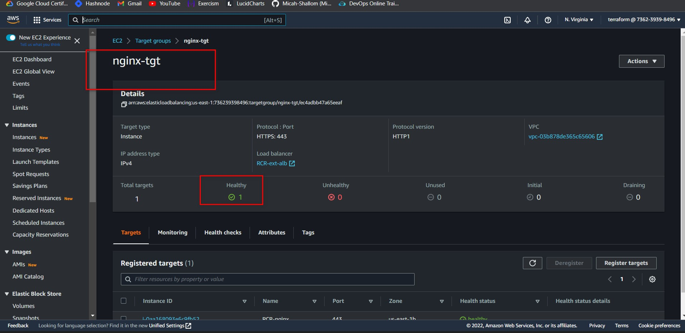
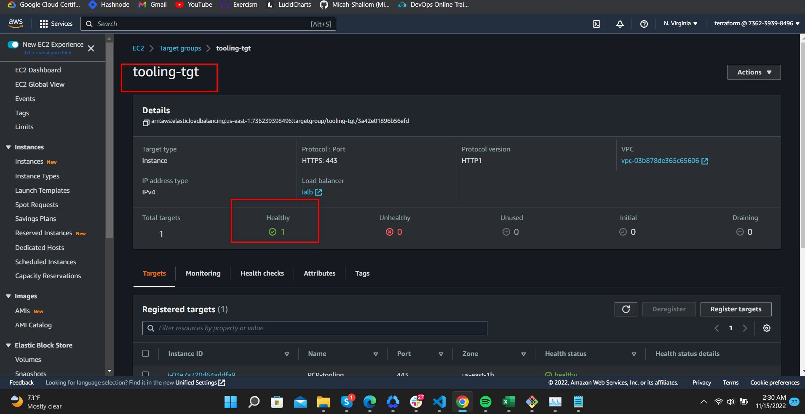
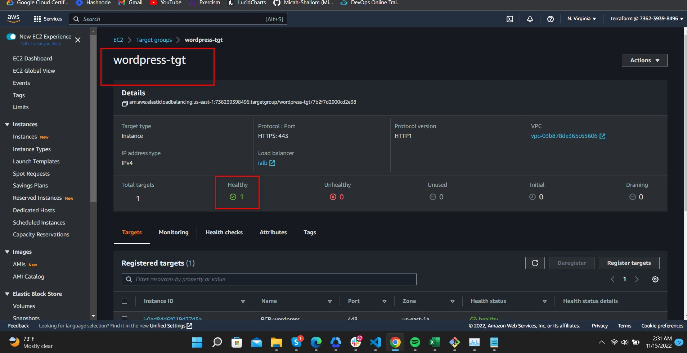
  - Follow the outlined steps 
  - Click connect and continue 
  - Go back to Registry
  - Click "Public private module"
  - Click the VCS you configured and find the name of your module repo
  - Select the module and click the "Publish module" button 
  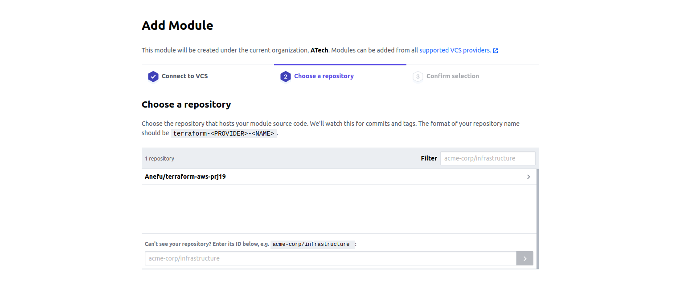
  - Copy the configuration details, you'll need it later for when you want to use the module
- Create a configuration that uses the module
  - Create a new repo (e.g **test-registry**)
  - Create main.tf, variables.tf and outputs.tf files
  - In your main.tf file, paste in the following block
  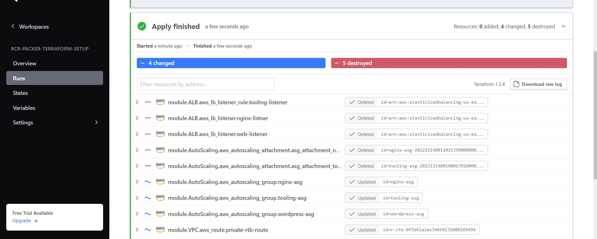
  ```
  terraform {
  required_providers {
    aws = {
      source = "hashicorp/aws"
    }
  }
  }

  provider "aws" {
    region = var.region
  }

  module "prj19" {
    source  = "app.terraform.io/ATech/prj19/aws"
    name   = var.name
    region = var.region
    prefix = var.prefix
    version = "1.0.0"
  }
  ```
  replace the **module** block with the configuration details you copied earlier.
  - In your variables.tf file, add the following
  ```
  variable "region" {
    description = "This is the cloud hosting region where your webapp will be deployed."
  }

  variable "prefix" {
    description = "This is the environment your webapp will be prefixed with. dev, qa, or prod"
  }

  variable "name" {
    description = "Your name to attach to the webapp address"
  }
  ```
  - Add the following to outputs.tf file
  ```
  output "website_endpoint" {
    value = module.prj19.endpoint
  }
  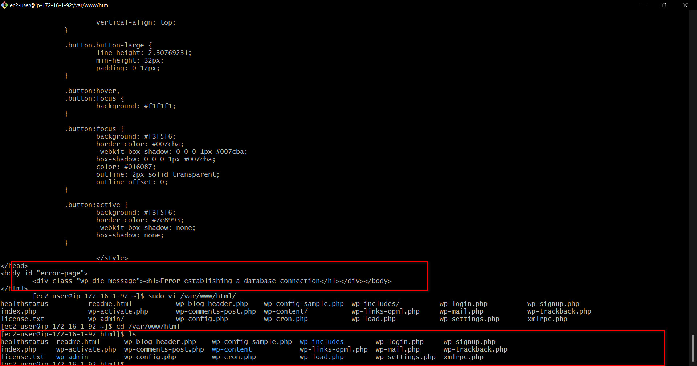
  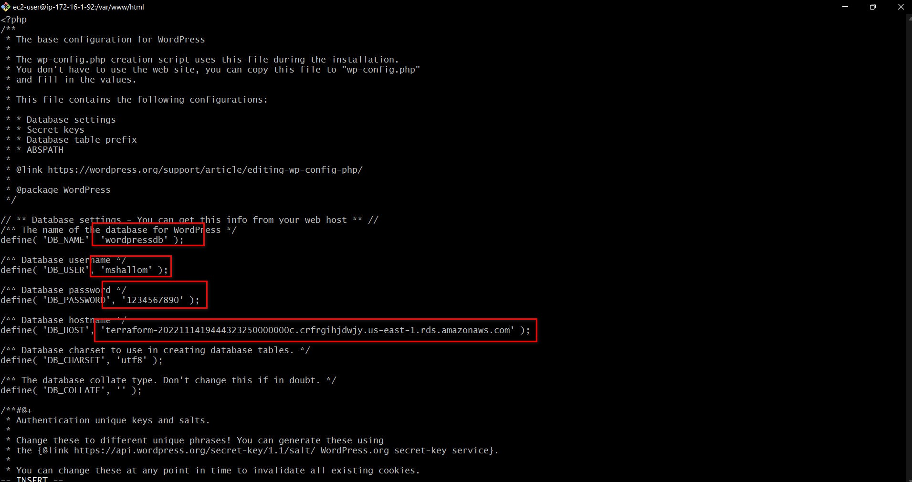
  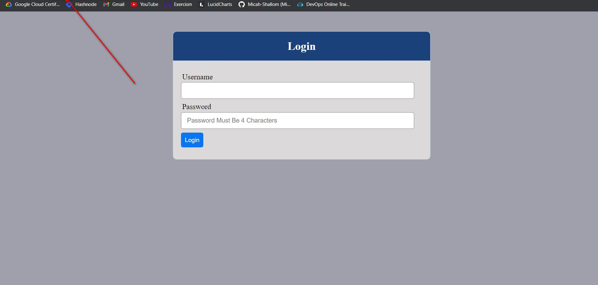
  ```
  Replace **prj19** with the name of the module block in the **main.tf** file.
- Create a workspace for the repo like we did above
  - Configure your environment variables
  - Configure three Terraform variables that will serve as input to the module based on the names of variables in your **variables.tf** file
- Deploy the infrastructure
  - From your workspace's Overview tab
  - Click Actions (on the right) and click Start new plan 
  - Enter any name you like
  - After the **plan** run, confirm and apply like above 
  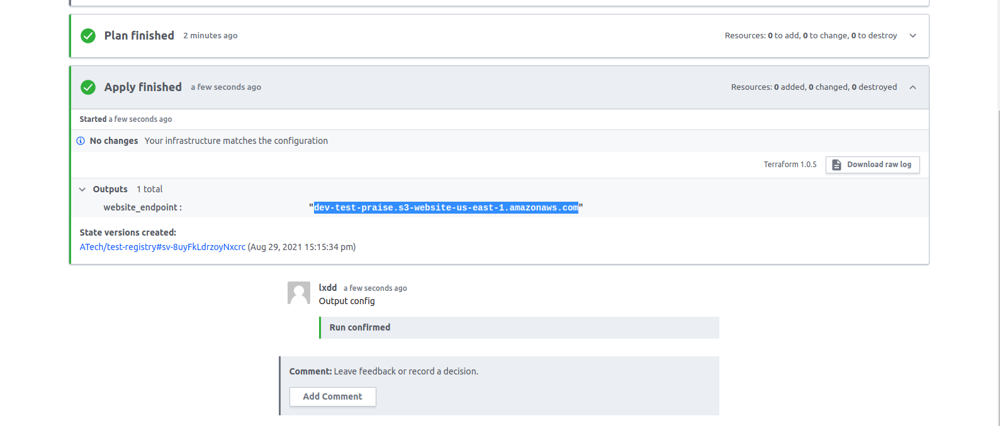
  - You should get an output that's URL to a page hosted on an S3 bucket 
  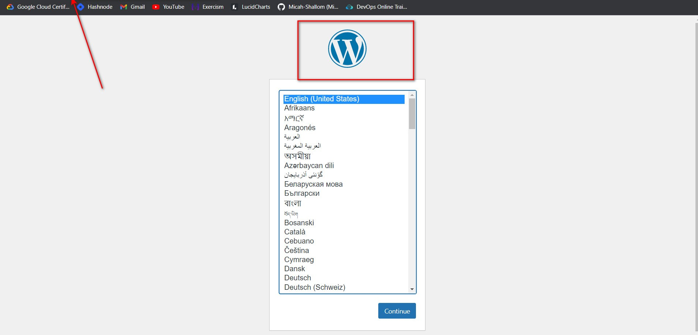
- Destroy the infrastruture like we did above.

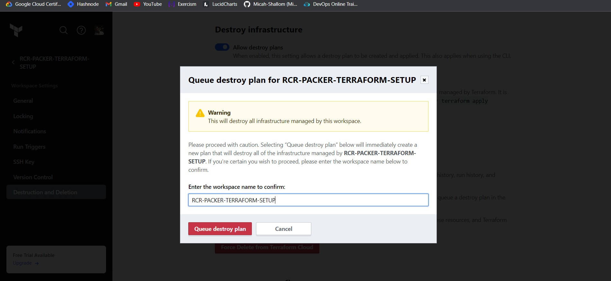

