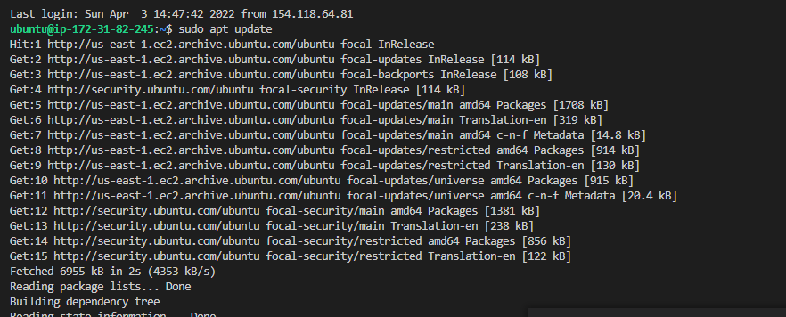
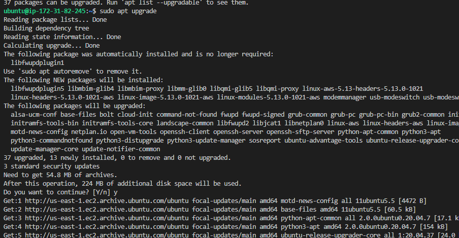
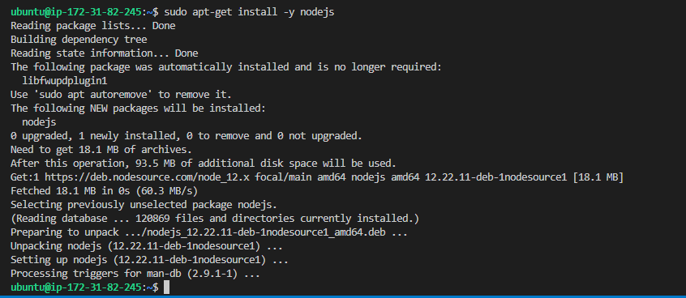
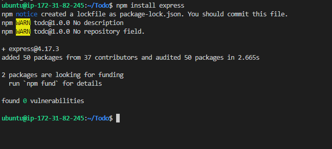
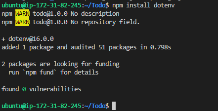
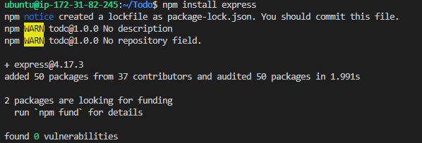
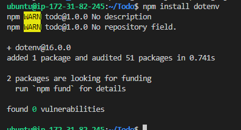
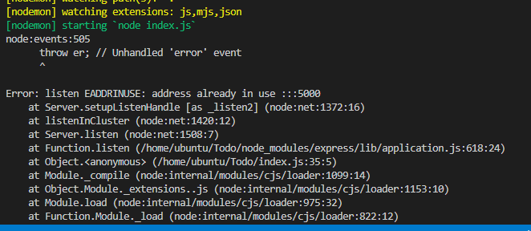
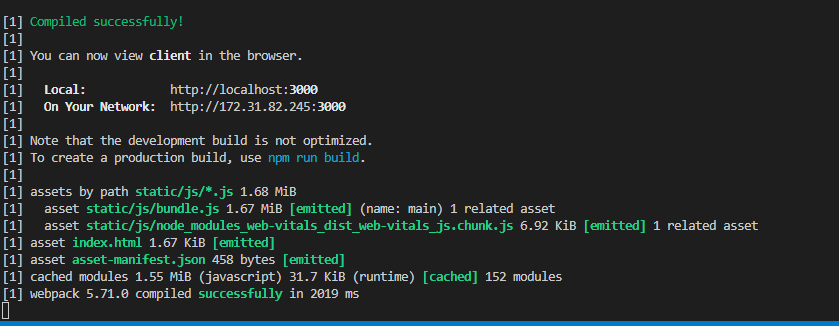
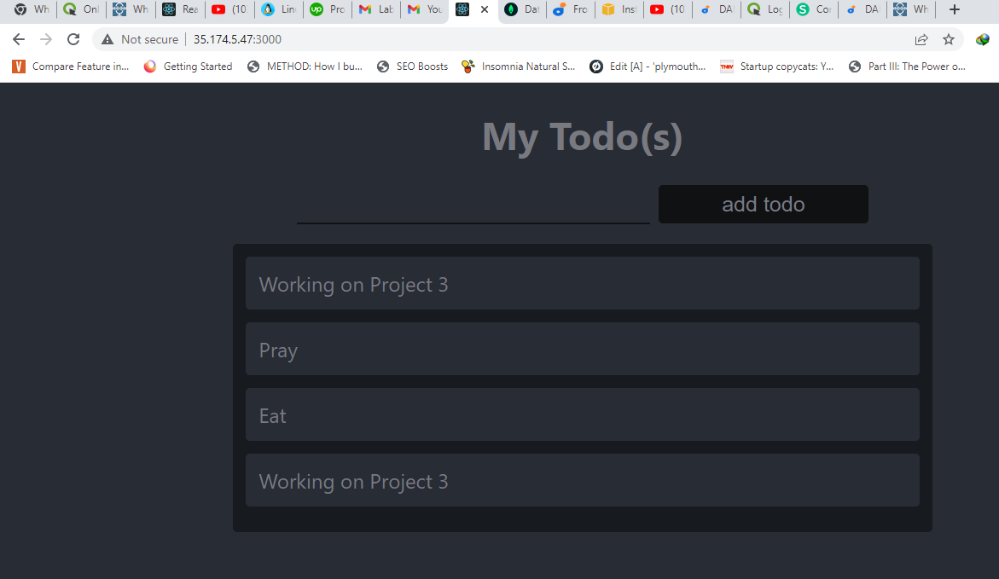

# MERN STACK IMPLEMENTATION
## Creating a SIMPLE TO-DO APPLICATION ON MERN WEB STACK

`sudo apt update`

`sudo apt upgrade`

`sudo apt-get install -ynodejs`

`npm install express`

`npm install dotenv`

`npm install express`

`npm install dotenv`

`npm run dev`

Threw a address :5000 already in use.

Ran the following command to kll the process 

lsof -i tcp:5000
kill -9 85214

`npm run dev`

Project concluded

