##Project 4

#Install Ec2 instance

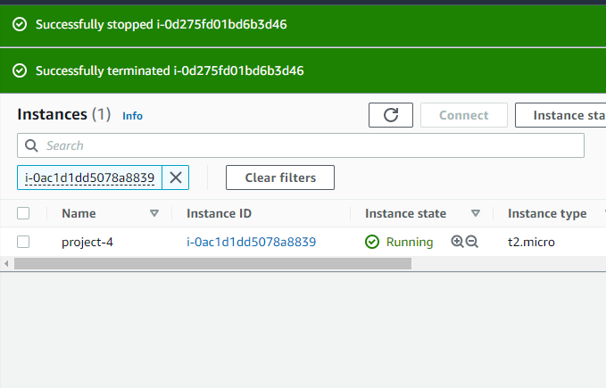

`sudo apt install -y mongodb`

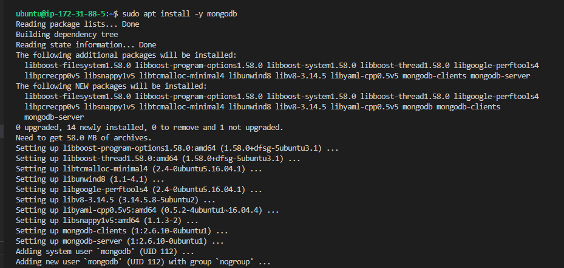

`install -y nodejs`

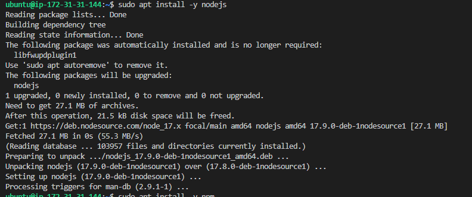

`sudo apt install -y npm`

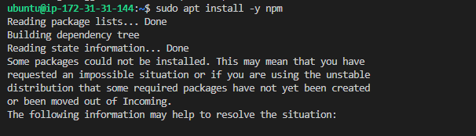

install certificates

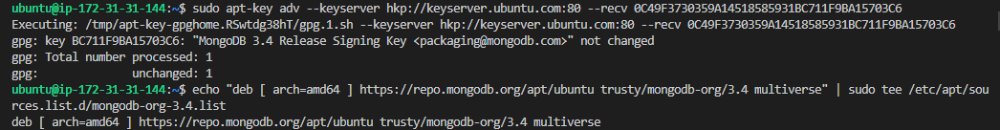

`sudo apt install -y mongodb`

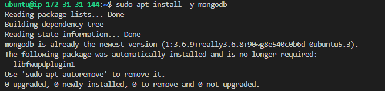

`sudo service mongodb start` and `sudo systemctl status mongodb`

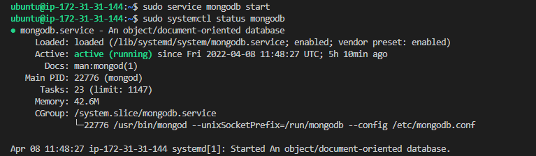

`sudo apt install -y npm`

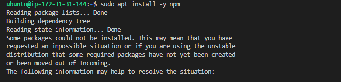

sudo npm install body-parser

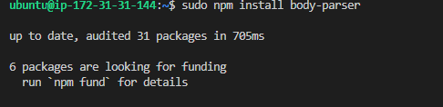

npm init

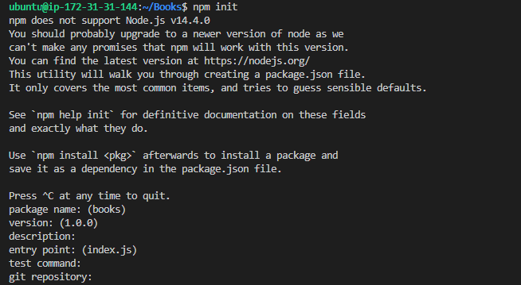

Ran node server.js with error.

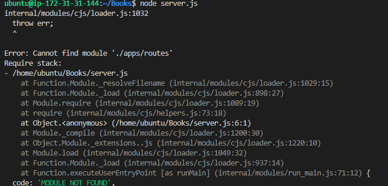

Corrections

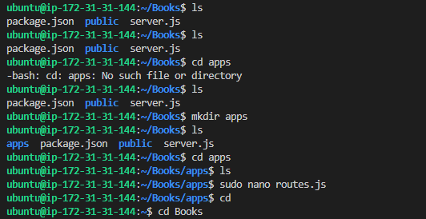

Ran node server.js again with error.

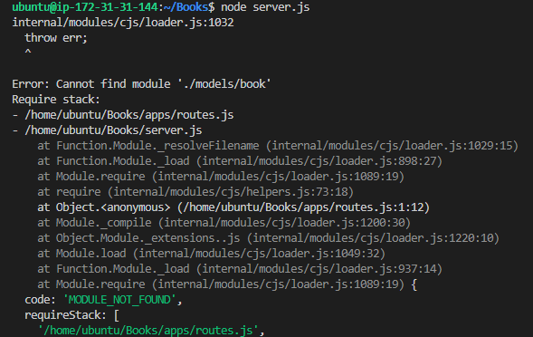

Problem solved.

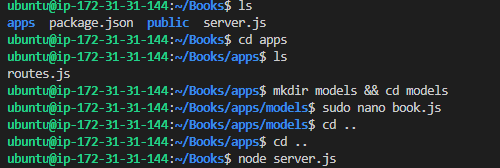

Done. Success!

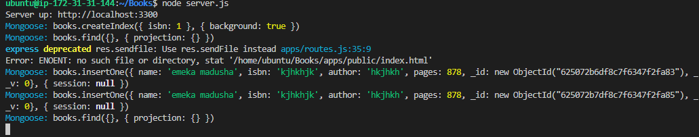

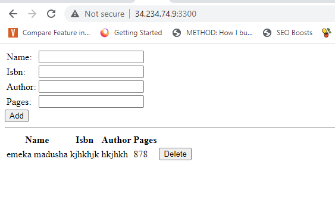