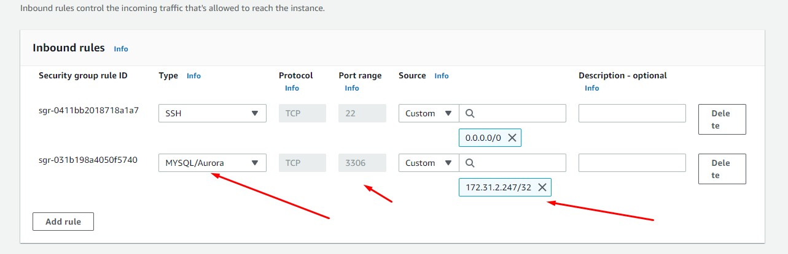

 #Project 5

 Install 2 Ec2 instance. 1 is Sever for database, 2nd is client machine

 

 Server

 `sudo mysql_secure_installation`

  

  `CREATE DATABASE test_db;`

  

  `GRANT ALL ON test_db.* TO 'remote_user'@'%' WITH GRANT OPTION;`

   

   `FLUSH PRIVILEGES;`
   

   `sudo nano /etc/mysql/mysql.conf.d/mysqld.cnf`
   `sudo systemctl restart mysql`

 

 CLIENT

`sudo apt update`

Install mysql client

`ip addr show`

Add client private ip to server security inbound rules to allow access to mysql

sudo mysql -u remote_user -h 172.31.89.248 -p

