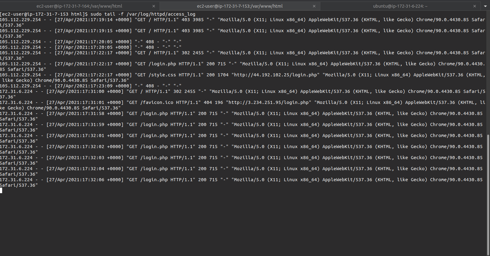
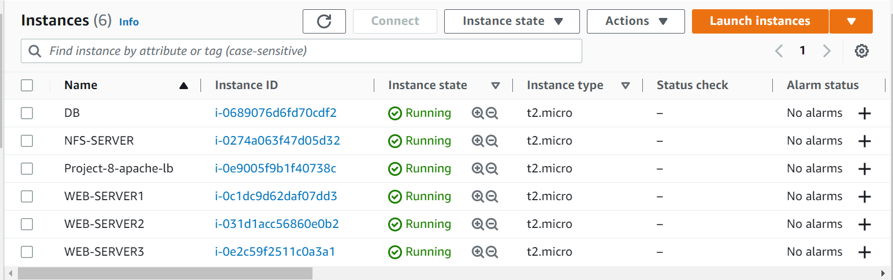
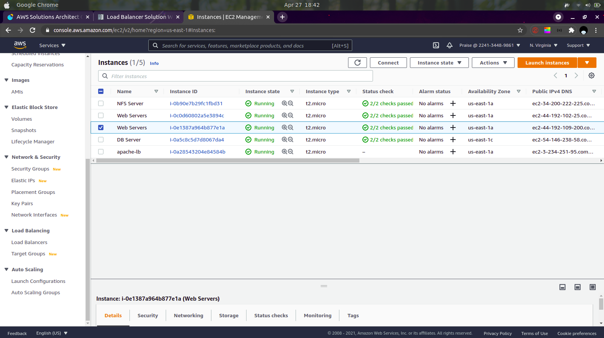

## LOAD BALANCER SOLUTION WITH APACHE


# **Step 1: Configure architecture from project 7**
In project seven, We extended our 3- tier architecture for website by adding an NFS server. NFS holds static files shared across the webserver. This architecture makes our webservers stateless. However In our previous architecture, it implies we wll need to access each webserver directly from its public IP. This is not a good use of our resources because one server may unintentionally process all the request.   
To solve this problem, we need a single point of entry which routes traffic accross our webserver(3). Depending our configuration, the webserver can equally share the incoming request.


**Load Balancers** provide this single point of entry. They can be software based or hardware based. Examples of software based load balancer are:

- Nginx

# **Step 2: Configure Apache as a Load Balancer**


## Your instances should look something like this: 
 

  
## Open TCP 80 on the instance's security group


- One RHEL8 NFS server


### Configure Apache As A Load Balancer

- Create an Ubuntu Server 20.04 EC2 instance and name it Project-8-apache-lb,

- Open TCP port 80 on Project-8-apache-lb

- Install Apache Load Balancer on Project-8-apache-lb server and configure it to point traffic coming to LB to both Web Servers:

    
        #Install apache2
        sudo apt update
        sudo apt install apache2 -y
        sudo apt-get install libxml2-dev

        sudo a2enmod rewrite
        sudo a2enmod proxy
        sudo a2enmod proxy_balancer
        sudo a2enmod proxy_http
        sudo a2enmod headers
        sudo a2enmod lbmethod_bytraffic

- Restart apache2 service
    
  `sudo systemctl restart apache2`
- Make sure apache2 is up and running
  `sudo systemctl status apache2`
  
  
- Configure load balancing:
      sudo vi /etc/apache2/sites-available/000-default.conf

      #Add this configuration into this section <VirtualHost *:80>  </VirtualHost>
    
        <Proxy "balancer://mycluster">
               BalancerMember http://<WebServer1-Private-IP-Address>:80 loadfactor=5 timeout=1
               BalancerMember http://<WebServer2-Private-IP-Address>:80 loadfactor=5 timeout=1
               ProxySet lbmethod=bytraffic
               # ProxySet lbmethod=byrequests
        </Proxy>

        ProxyPreserveHost On
        ProxyPass / balancer://mycluster/
        ProxyPassReverse / balancer://mycluster/


       #Restart apache server

       sudo systemctl restart apache2
       
- Verify that our configuration works – try to access your LB’s public IP address or Public DNS name from your browser:
   
    Run sudo tail -f /var/log/httpd/access_log on both servers and check the outputs (refresh your browser a couple or more times)
    ```
  

  `http://<Load-Balancer-Public-IP-Address-or-Public-DNS-Name>/index.php`

- If in the Project-7 you mounted /var/log/httpd/ from your Web Servers to the NFS server – unmount them and make sure that each Web Server has its own log directory.

- Open two ssh/Putty consoles for both Web Servers and run following command:

  `sudo tail -f /var/log/httpd/access_log`


- You should see something like the screenshot below:
