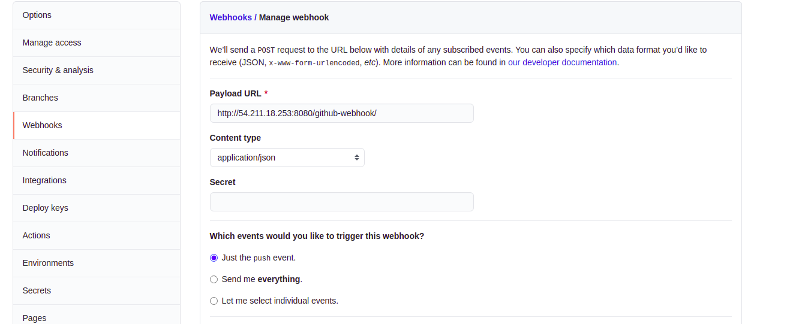
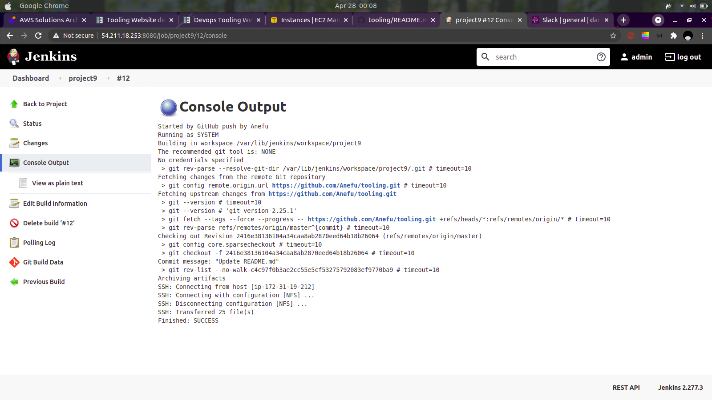
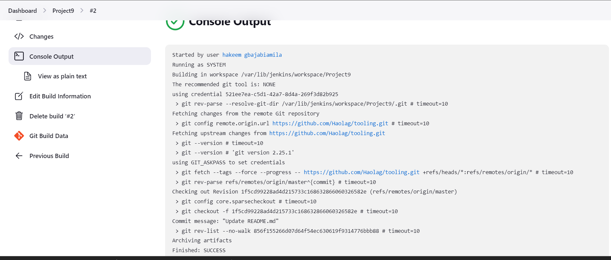
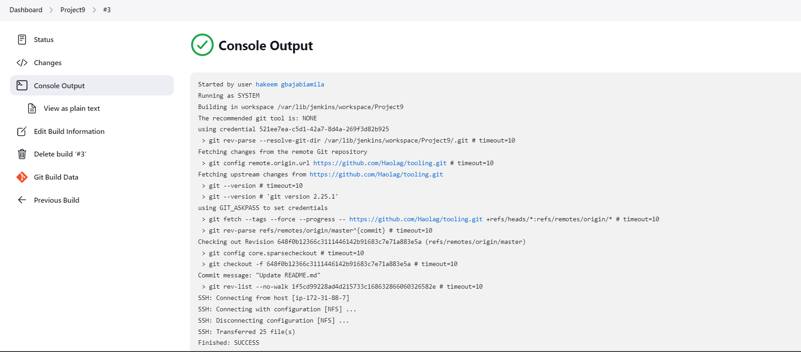

# Step 1: Install Jenkins Server
 

- ## Using the same architecture and configuration from project 8.
  
- ## Launch a new Ubuntu Server named Jenkins


- ## Install JDK (Jenkins is a Java based application)
    ```
    sudo apt update
    sudo apt install default-jdk-headless
    ```


- ## Install Jenkins
    ```
    wget -q -O - https://pkg.jenkins.io/debian-stable/jenkins.io.key | sudo apt-key add -

    sudo sh -c 'echo deb https://pkg.jenkins.io/debian-stable binary/ > \
    /etc/apt/sources.list.d/jenkins.list'

    sudo apt update
    sudo apt-get install jenkins
    ```


- ## Make sure Jenkins service is running.
    ```
    sudo systemctl status jenkins
    ```
    

- ## Open TCP port 8080 on Jenkins server's security group
    

- ## Perform initial Jenkins setup
  - Open \<Jenkins-Server-Public-IP>:8080 on your web browser
  - When prompted for default admin password, run
      ```
      sudo cat /var/lib/jenkins/secrets/initialAdminPassword
      ```
      Copy and paste in the field provided.
  - Choose install suggested plugins.
  - Create admin user.


# Step 2: Configure Jenkins to retrieve source code from GitHub using WebHooks
- ## Enable WebHooks in GitHub repo settings
  - Click on the tooling repo
  - Click settings
  - Click WebHooks from the left pane
  - Click add webhook
  - Enter \<Jenkins-server-public-ip>:8080/github-webhook/
  - For content type, select application/json
  - Leave everything else and click add webhook
    

- ## Go to Jenkins web console, click “New Item” and create a “Freestyle project”
  - Under Source Code Management, select Git
  - Paste the repo URL, and add your GitHub account credentials
  - Save the configuration and click "Build Now" to trigger a manual build.
    

  - Click configure for your job and:
    - Select GitHub Hook trigger for GitScm polling
    - Configure Post Build Actions to archive the artifacts
  - Make a change in your repo (edit a file) and commit to the master branch.
  
# Step 3: Configure Jenkins to copy files to NFS server via SSH

- ## Install Publish Over SSH plugin
  - On main dashboard, select Manage Jenkins and then select Manage Plugins
  - Click "Available" tab and in the search bar, enter "Publish Over ssh"
  - Check the box next to the plugin and click "Install without restart"
    

- ## Configure the job/project to copy artifacts over to NFS server.
  - On main dashboard select Manage Jenkins and then Configure System
  - Scroll down to Publish Over SSH plugin configuration and:
    - Paste in the content of your private (*.pem) key file.
    - For hostname, enter the private ip address of the NFS server
    - For username, enter ec2-user
    - Remote directory /mnt/apps
  - Save the configuration
  - Open the job configuration and add another Post Build Action
    - "Send build artifacts over SSH"
    - Since we want to copy all files, enter ** in the "Source files" field.
  - Save the configuration
  - Edit a file on repo and ensure the job builds successfully, automatically.
   
   
    
     
      
       