PERSISTING DATA IN KUBERNETES

Before starting this project I installed awscl, then configure it with access_key_id and secret_access_key before creating EKS cluster and node group from aws console.

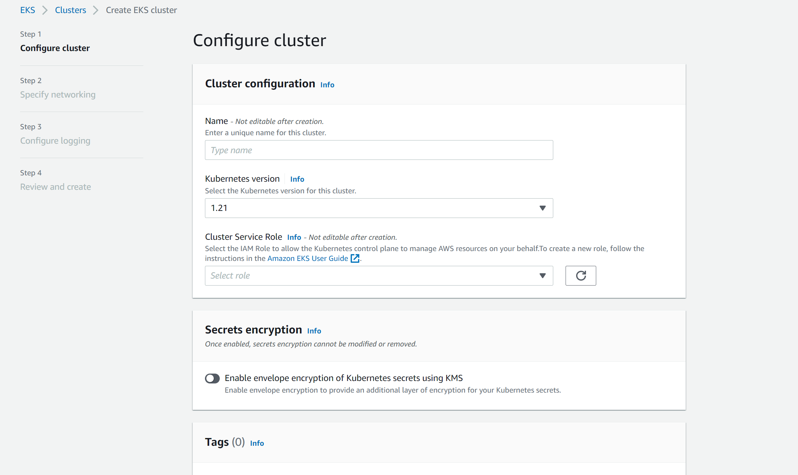

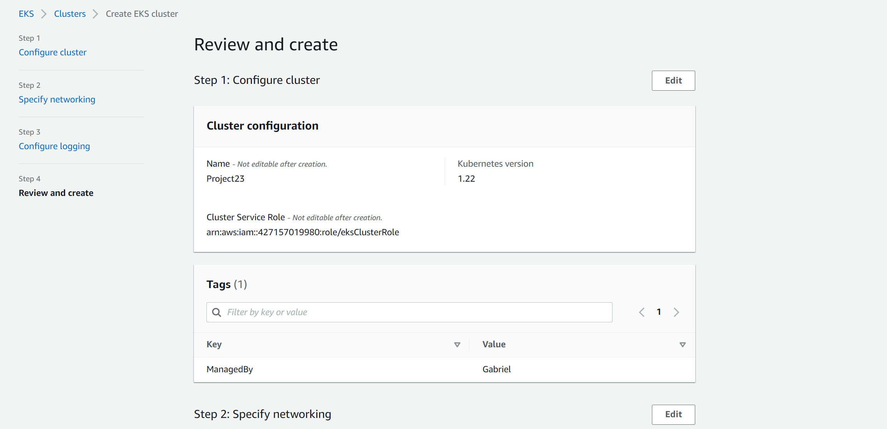

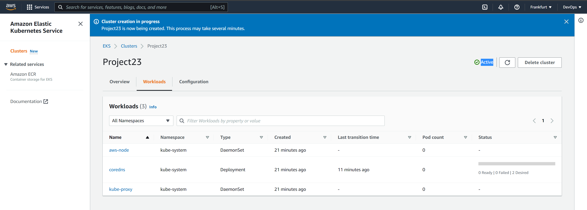

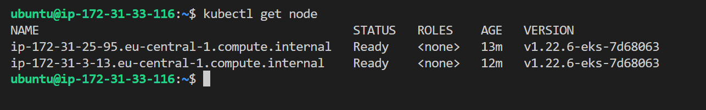

Create the kubeconfig file using


```
aws eks update-kubeconfig --region <eks_region> --name <eks_name>
```

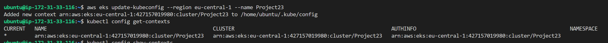

Create nginx deployment and apply it.

```
apiVersion: apps/v1
kind: Deployment
metadatas:
  name: nginx-deployment
  label:
    tier: frontend
spec:
  replicas: 1
  selector:
    matchLabels:
      tier: frontend
  template:
    metadatas:
      name: nginx
      tier: frontend
    spec:
      containers:
        - name: nginx
          image: nginx:latest
        ports:
        - containerPort: 80
          protocol: TCP
          name:nginx

```

Verify that the pod is running. Check the logs of the pod

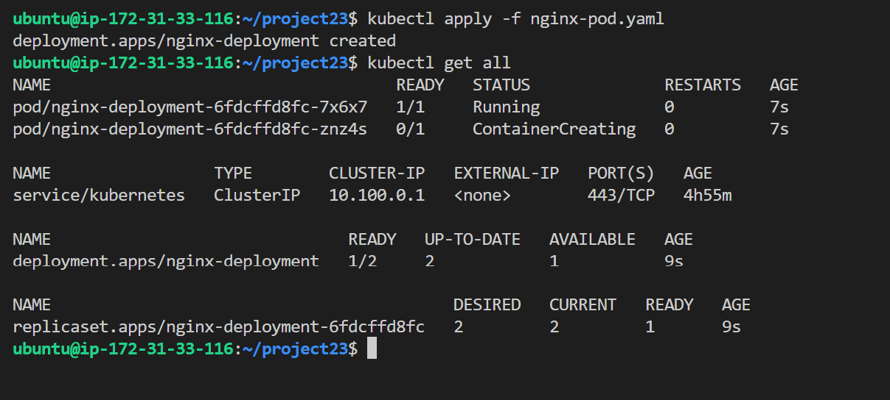

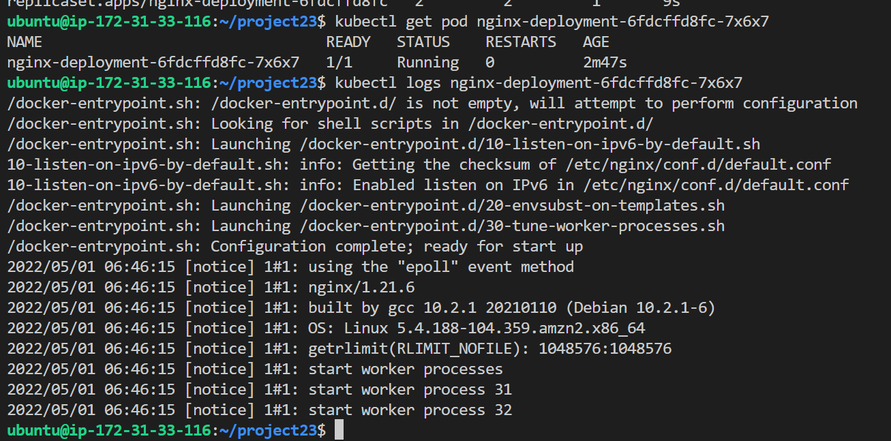

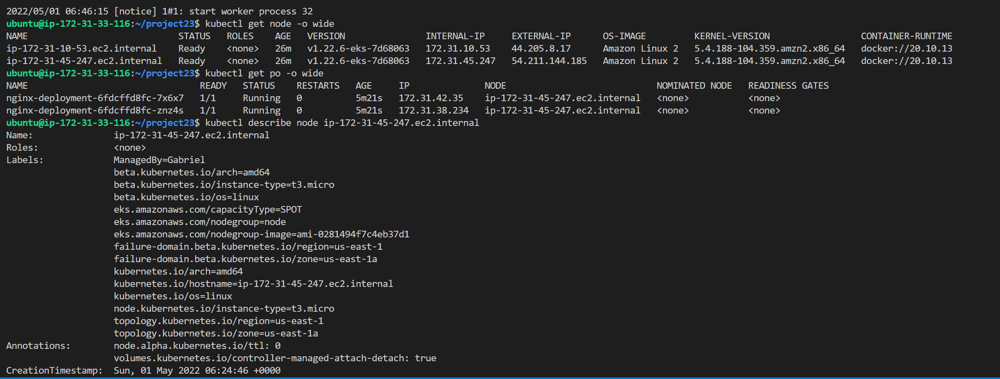

Exec into the pod and navigate to the nginx configuration file /etc/nginx/conf.d


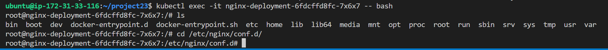

Open the config files to see the default configuration.

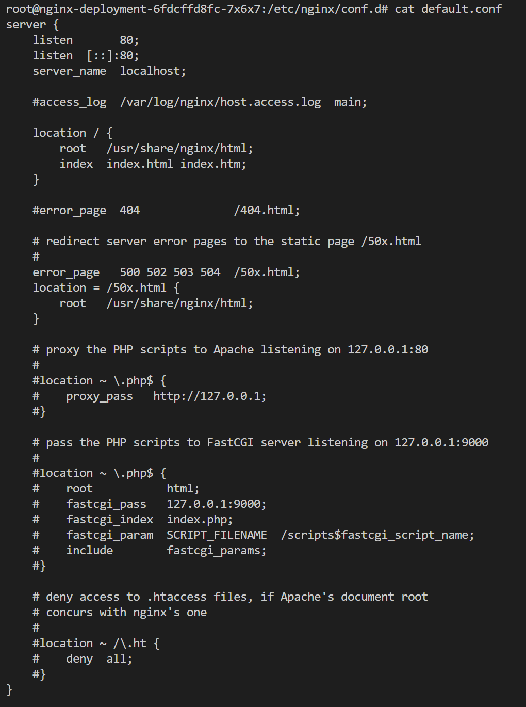

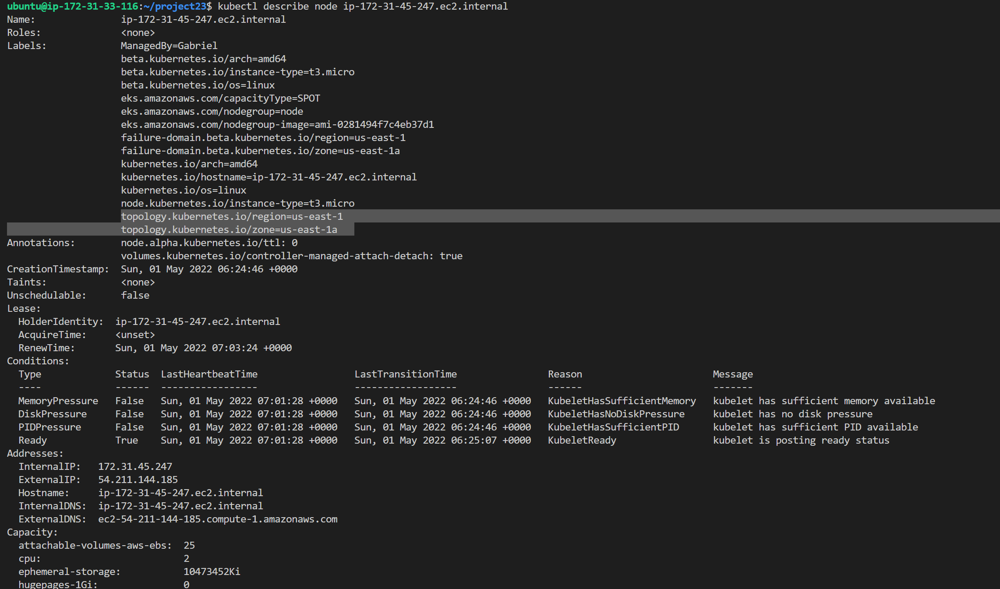

Create an Elastic Block Storage (EBS) volume in the same region and availability zone as the worker node.


Copy the volume ID of the newly created volume and update the deployment configuration with the volume spec.

Apply the new configuration and check the pod. After applying the configuration, I realized that the new pod is in pending state and didn't replace one of the pod. This is because the Deployment maxUnavailable is 25% for the rollingUpdate, so I changed it to 1 for it to work properly.

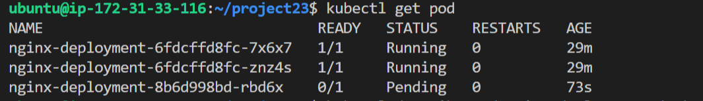

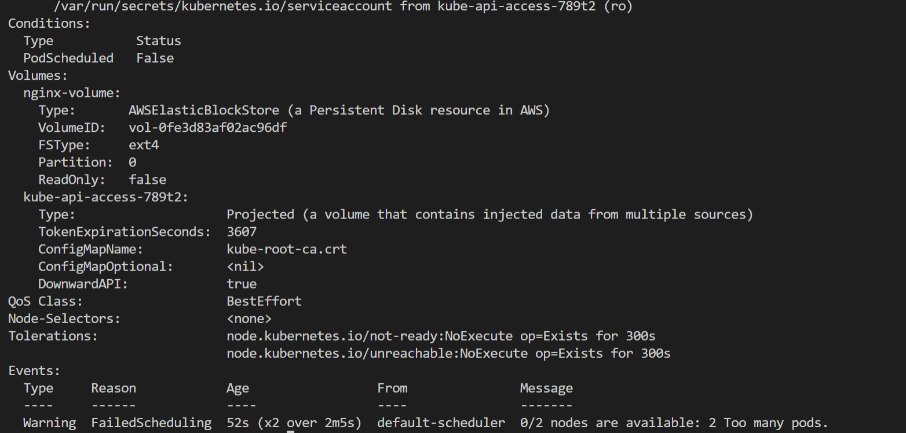


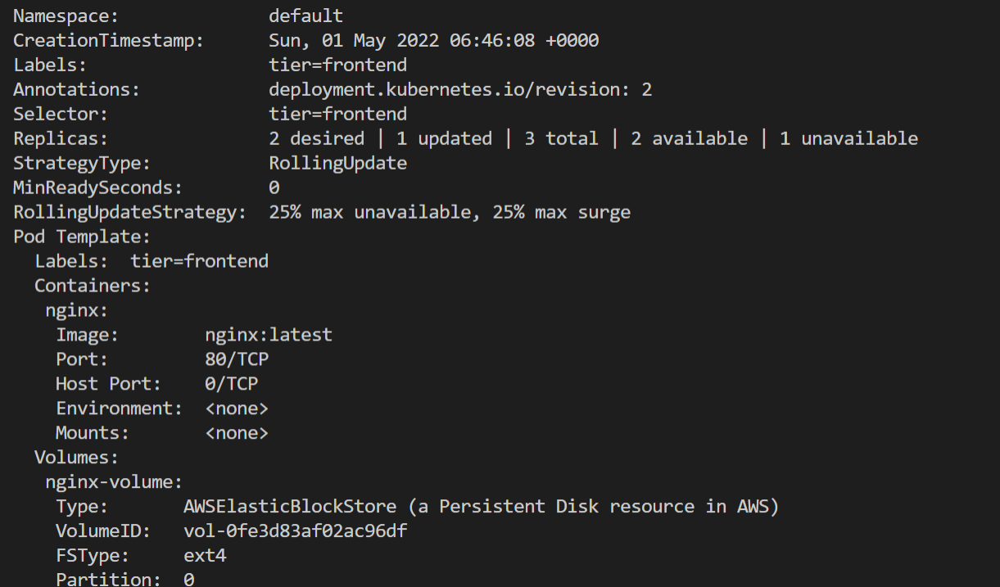

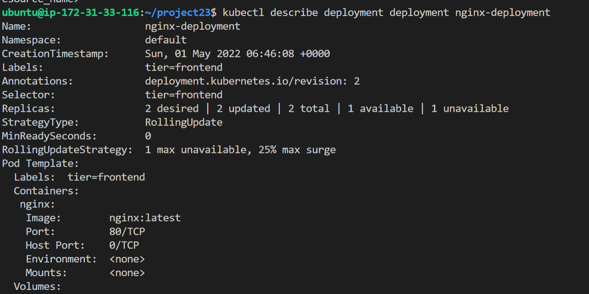

```

 strategy:
    type: RollingUpdate
    rollingUpdate:
      maxUnavailable: 1

```

Create NodePort service for the node deployment and trying to reach the endpoint.


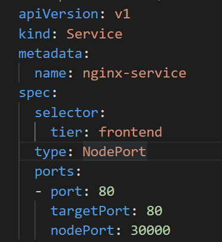

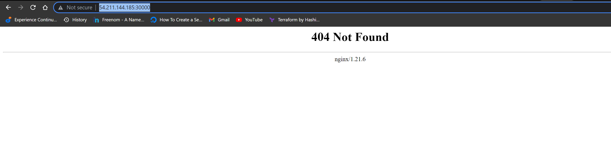

I got a 403 error. This is because mounting a volume on a filesystem that already contains data will automatically erase all the existing data. This strategy for stateful is preferred if the mounted volume already contains the data which you want to be made available to the container.

MANAGING VOLUMES DYNAMICALLY WITH PVS AND PVCS


Create a manifest file for a PVC, and based on the gp2 storageClass a PV will be dynamically created.


```
apiVersion: v1
kind: PersistentVolumeClaim
metadata:
  name: nginx-volume-claim
spec:
  resources:
    requests:
      storage: 1Gi
  storageClassName: gp2
  accessModes:
    - ReadWriteOnce
```

Apply the manifest file and Run get on the pvc.

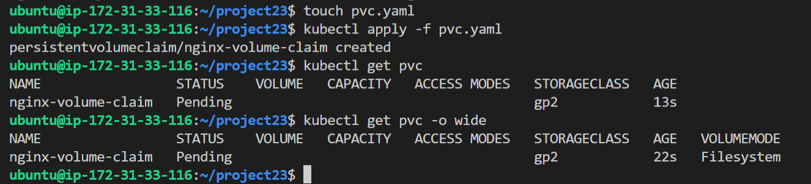

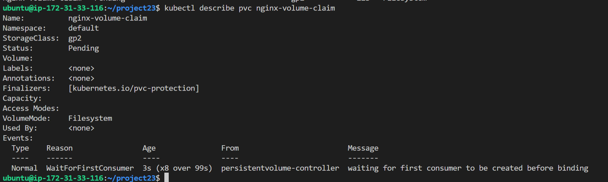

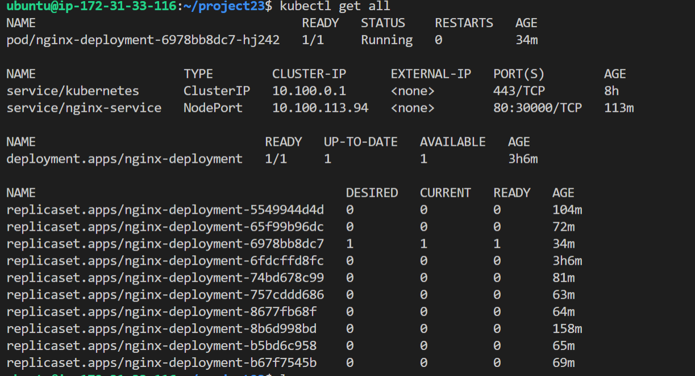

Then configure the Pod spec to use the PVC.


```

apiVersion: apps/v1
kind: Deployment
metadata:
  name: nginx-deployment
  labels:
    tier: frontend
spec:
  replicas: 1
  selector:
    matchLabels:
      tier: frontend
  strategy:
    type: RollingUpdate
    rollingUpdate:
      maxUnavailable: 1
  template:
    metadata:
      labels:
        tier: frontend
    spec:
      nodeSelector:
        topology.kubernetes.io/zone: us-east-1a
      containers:
      - name: nginx
        image: nginx:latest
        ports:
        - containerPort: 80
          protocol: TCP
        volumeMounts:
        - name: nginx-volume
          mountPath: /tmp/gabriel/
      volumes:
        - name: nginx-volume
          persistentVolumeClaim:
            claimName: nginx-volume-claim
```

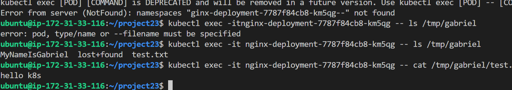

Create a statefulset manifest file and run kubectl apply -f statefulset.yaml


```
apiVersion: apps/v1
kind: StatefulSet
metadata:
  name: nginx-statefulset
spec:
  selector:
    matchLabels:
      tier: frontend
  serviceName: nginx-service
  replicas: 1
  template:
    metadata:
      labels:
        tier: frontend
    spec:
      containers:
      - name: nginx
        image: nginx:latest
        ports:
        - containerPort: 80
          name: http
          protocol: TCP
        volumeMounts:
        - name: nginx-volume
          mountPath: /tmp/gabriel

  volumeClaimTemplates:
  - metadata:
      name: nginx-volume
    spec:
      accessModes: [ "ReadWriteOnce" ]
      resources:
        requests:
          storage: 1Gi
```

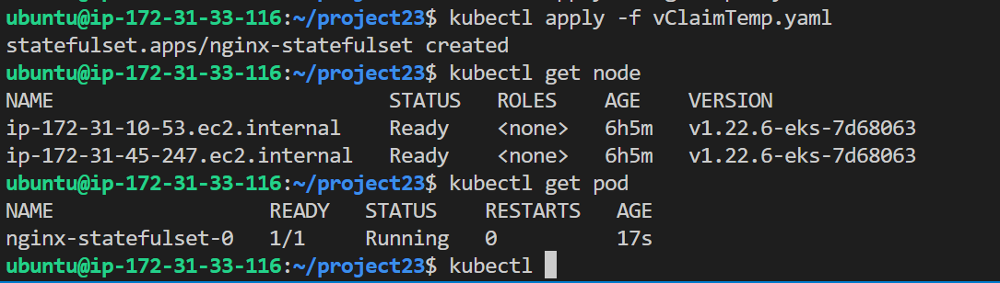

CONFIGMAP


exec into the running container, copy the output and paste it on the config map manifest file.


```

kubectl exec -it <pod_name> -- cat /usr/share/nginx/html/index.html

```

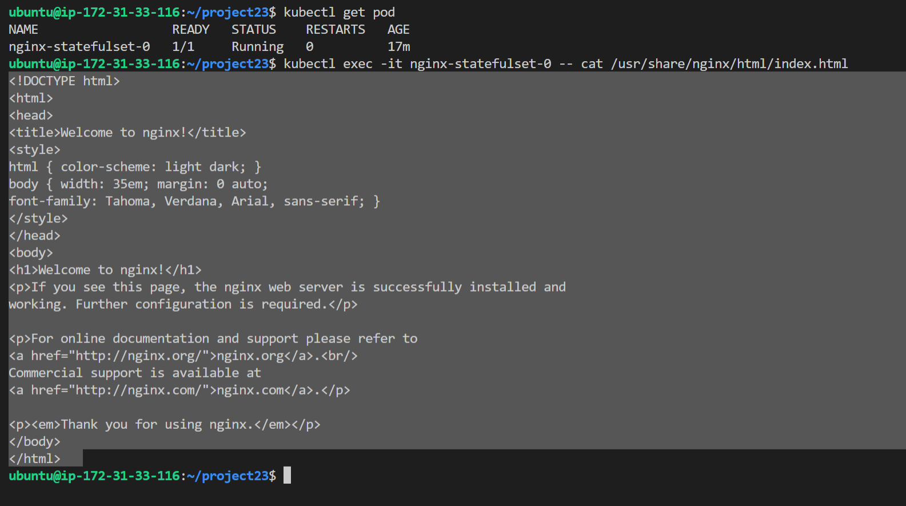

Persisting configuration data with configMaps


```
apiVersion: v1
kind: ConfigMap
metadata:
  name: website-index-file
data:
  index-file: |
   <!DOCTYPE html>
   <html>
   <head>
   <title>Welcome to nginx!</title>
   <style>
   html { color-scheme: light dark; }
   body { width: 35em; margin: 0 auto;
   font-family: Tahoma, Verdana, Arial, sans-serif; }
   </style
   </head>
   <body>
   <h1>Welcome to nginx!</h1>
   <p>If you see this page, the nginx web server is successfully installed and
   working. Further configuration is required.</p>
   <p>For online documentation and support please refer to
   <a href="http://nginx.org/">nginx.org</a>.<br/>
   Commercial support is available at
   <a href="http://nginx.com/">nginx.com</a>.</p>
   
   <p><em>Thank you for using nginx.</em></p>
   </body>
   </html>

   ```

   Apply the new manifest file

Update the statefulset file to use the configmap in the volumeMounts section

```

apiVersion: v1
kind: ConfigMap
metadata:
  name: website-index-file
data:
  index-file: |
   <!DOCTYPE html>
   <html>
   <head>
   <title>Welcome to nginx!</title>
   <style>
   html { color-scheme: light dark; }
   body { width: 35em; margin: 0 auto;
   font-family: Tahoma, Verdana, Arial, sans-serif; }
   </style>
   </head>
   <body>
   <h1>Welcome to nginx!</h1>
   <p>If you see this page, the nginx web server is successfully installed and
   working. Further configuration is required.</p>
   
   <p>For online documentation and support please refer to
   <a href="http://nginx.org/">nginx.org</a>.<br/>
   Commercial support is available at
   <a href="http://nginx.com/">nginx.com</a>.</p>
   
   <p><em>Thank you for using nginx.</em></p>
   </body>
   </html>

   ```

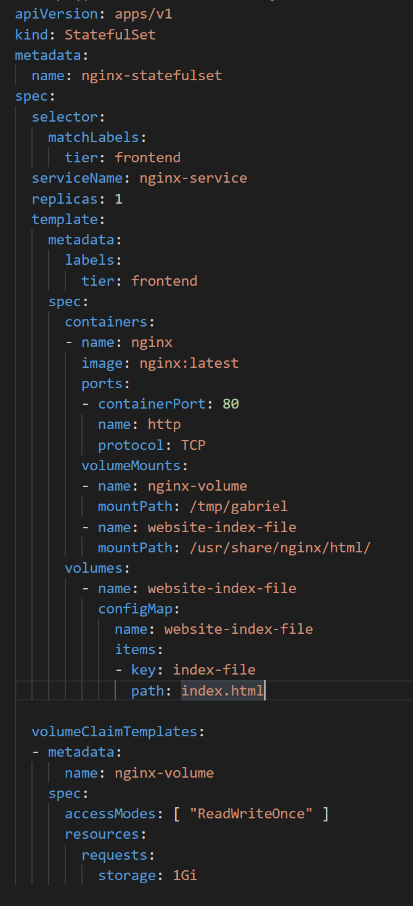

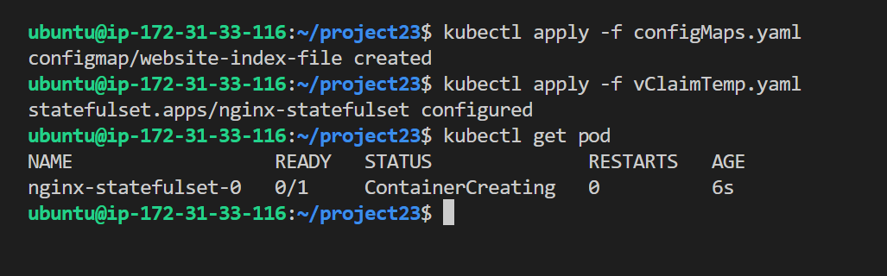


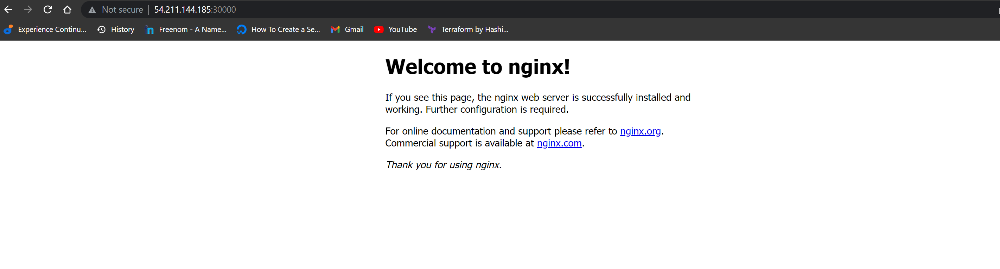

exec into the pod and list the /usr/share/nginx/html directory

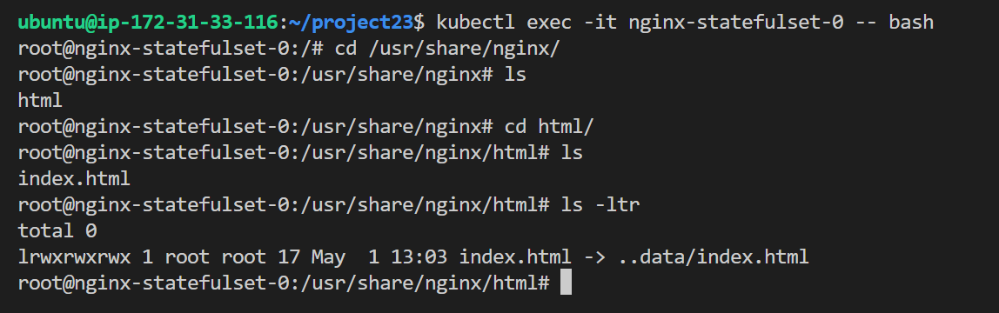

Update the configmap

```

kubectl edit cm website-index-file

```

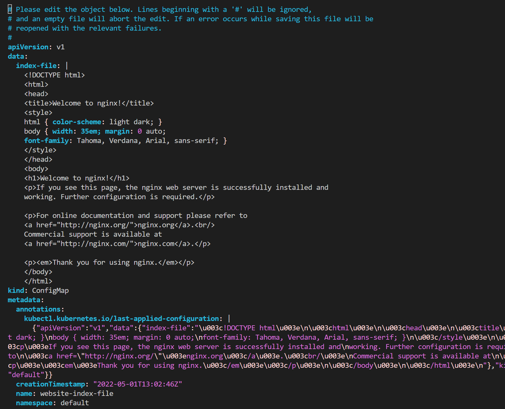


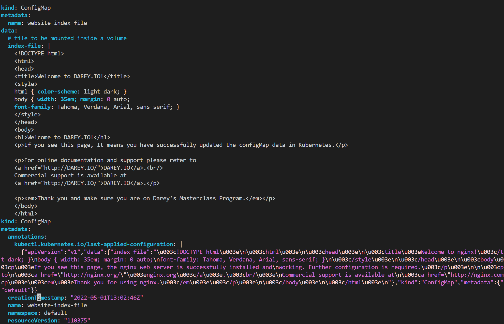


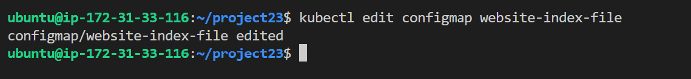


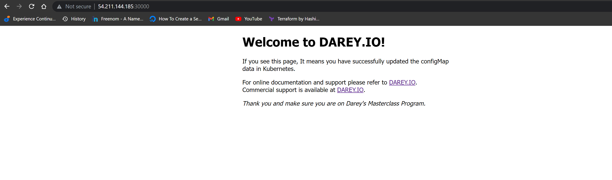


